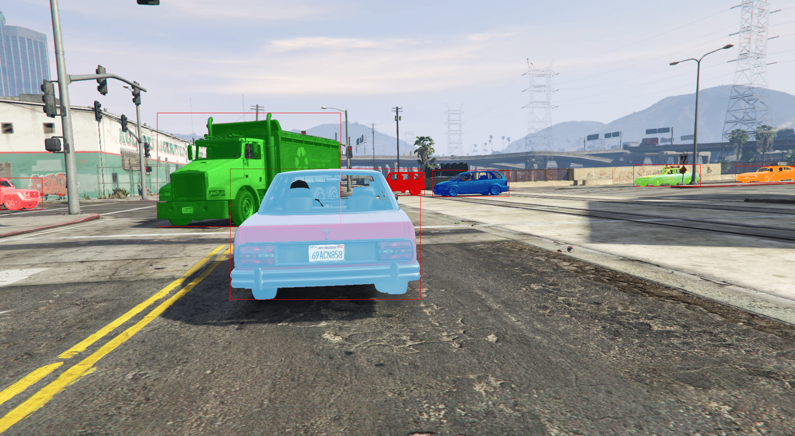

# Driving in the Matrix

Steps to reproduce training results for the paper 
[Driving in the Matrix: Can Virtual Worlds Replace Human-Generated Annotations for Real World Tasks?](https://arxiv.org/abs/1610.01983)
conducted at [UM & Ford Center for Autonomous Vehicles (FCAV)](https://fcav.engin.umich.edu).



Specifically, we will train [MXNet RCNN](https://github.com/dmlc/mxnet/tree/master/example/rcnn) on our 
[10k dataset](https://fcav.engin.umich.edu/sim-dataset) 
and evaluate on [KITTI](http://www.cvlibs.net/datasets/kitti/eval_object.php).

## System requirements

To run training, you need [CUDA 8](https://developer.nvidia.com/cuda-toolkit), [NVIDIA Docker](https://github.com/NVIDIA/nvidia-docker)
and a linux machine with at least one Nvidia GPU installed. Our training was conducted using 4 Titan-X GPUs.

Training time per epoch for us was roughly 
10k: 40 minutes,
50k: 3.3 hours,
200k: 12.5 hours. We plan on providing the trained parameters from the best performing epoch for 200k soon.
 

## Download the dataset

Create a directory and download the archive files for 10k images, annotations and image sets from [our website](https://fcav.engin.umich.edu/sim-dataset/).
Assuming you have downloaded these to a directory named `ditm-data` (driving in the matrix repro):

```
$ ls -1 ditm-data
repro_10k_annotations.tgz
repro_10k_images.tgz
repro_image_sets.tgz
```

Extract them.

```
$ pushd ditm-data
$ tar zxvf repro_10k_images.tgz
$ tar zxvf repro_10k_annotations.tgz
$ tar zxvf repro_image_sets.tgz
$ popd
$ ls -1 ditm-data/VOC2012
Annotations
ImageSets
JPEGImages
```


## Train on GTA

To make training as reproducible (across our own machines, and now for you!) as possible, we ran training within 
a docker container [as detailed here](https://github.com/umautobots/nn-dockerfiles/tree/master/mxnet-rcnn).

If you are familiar with MXNet and its RCNN example and already have it installed, you will likely feel comfortable 
adapting these examples to run outside of docker.

### Build the MXNet RCNN Container

```
$ git clone https://github.com/umautobots/nn-dockerfiles.git
$ pushd nn-dockerfiles
$ docker build -t mxnet-rcnn mxnet-rcnn
$ popd
```

This will take several minutes.

```
$ docker images | grep mxnet
mxnet-rcnn                 latest               bb488173ad1e        25 seconds ago      5.54 GB
```

### Download pre-trained VGG16 network

```
$ mkdir -p pretrained-networks
$ cd pretrained-networks && wget http://data.dmlc.ml/models/imagenet/vgg/vgg16-0000.params && cd -
```

### Kick off training

```
$ mkdir -p training-runs/mxnet-rcnn-gta10k
$ nvidia-docker run --rm --name run-mxnet-rcnn-end2end \
  `#container volume mapping` \
  -v `pwd`/training-runs/mxnet-rcnn-gta10k:/media/output \
  -v `pwd`/pretrained-networks:/media/pretrained \
  -v `pwd`/ditm-data:/root/mxnet/example/rcnn/data/VOCdevkit \
  -it mxnet-rcnn \
  `# python script` \
  python train_end2end.py \
  --image_set 2012_trainval10k \
  --root_path /media/output \
  --pretrained /media/pretrained/vgg16 \
  --prefix /media/output/e2e \
  --gpus 0 \
  2>&1 | tee training-runs/mxnet-rcnn-gta10k/e2e-training-logs.txt
  
...
INFO:root:Epoch[0] Batch [20]	Speed: 6.41 samples/sec	Train-RPNAcc=0.784970,	RPNLogLoss=0.575420,	RPNL1Loss=2.604233,	RCNNAcc=0.866071,	RCNNLogLoss=0.650824,	RCNNL1Loss=0.908024,	
INFO:root:Epoch[0] Batch [40]	Speed: 7.10 samples/sec	Train-RPNAcc=0.807546,	RPNLogLoss=0.539875,	RPNL1Loss=2.544102,	RCNNAcc=0.895579,	RCNNLogLoss=0.461218,	RCNNL1Loss=1.019715,	
INFO:root:Epoch[0] Batch [60]	Speed: 6.76 samples/sec	Train-RPNAcc=0.822298,	RPNLogLoss=0.508551,	RPNL1Loss=2.510861,	RCNNAcc=0.894723,	RCNNLogLoss=0.406725,	RCNNL1Loss=1.005053,	
...
```

As the epochs complete, the trained parameters will be available inside `training-runs/mxnet-rcnn-gta10k`.

## Training on other segments

To train on 200k or 50k, first download and extract `repro_200k_images.tgz` and `repro_200k_annotations.tgz` and then
run a similar command as above but with `image_set` set to `2012_trainval50k` or `2012_trainval200k`.

## Evaluate on KITTI

### Download the KITTI object detection dataset

### Convert it to VOC format

### Evaluate GTA10k trained network on KITTI

### Convert VOC evaluations to KITTI format

### Run KITTI's benchmark on results

## Citation
If you find this useful in your research please cite:

> M. Johnson-Roberson, C. Barto, R. Mehta, S. N. Sridhar, K. Rosaen and R. Vasudevan, “Driving in the matrix: Can virtual worlds replace human-generated annotations for real world tasks?,” in IEEE International Conference on Robotics and Automation, pp. 1–8, 2017.
    
    @inproceedings{Johnson-Roberson:2017aa,
        Author = {M. Johnson-Roberson and Charles Barto and Rounak Mehta and Sharath Nittur Sridhar and Karl Rosaen and Ram Vasudevan},
        Booktitle = {{IEEE} International Conference on Robotics and Automation},
        Date-Added = {2017-01-17 14:22:19 +0000},
        Date-Modified = {2017-01-17 14:23:03 +0000},
        Keywords = {conf},
        Note = {accepted},
        Title = {Driving in the Matrix: Can Virtual Worlds Replace Human-Generated Annotations for Real World Tasks?},
        Year = {2017}}
